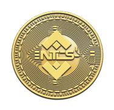

# 📚 About NTCS

<figure><figcaption></figcaption></figure>

**NTCS’s mission is to become its own ecosystem in the Web3 to ultimately attract a community of like-minded individuals who want to break free from the traditional paradigm by becoming an NTCS in the modern-day decentralized system.**\
\
**You can earn more rewards by doing your part must spread the word about $NTCS. The more people who are aware of the project's purpose, the larger the rewards you will get. We will hold a Shill-To-Earn contest.**\
\
**Whilst you hold $NTCS, you will also be rewarded with $BUSD passively, 5% redistribution of each transaction.**

## Contract Address:

bscscan: [<mark style="color:red;">**0xC6e62AD3B6532bd5EbDEc7b2d84235bcD65896FF**</mark>](https://bscscan.com/address/0xc6e62ad3b6532bd5ebdec7b2d84235bcd65896ff)<mark style="color:red;">****</mark>

pancakeswap: 0xC6e62AD3B6532bd5EbDEc7b2d84235bcD65896FF

Buy $NTCS: 0xC6e62AD3B6532bd5EbDEc7b2d84235bcD65896FF

<figure><figcaption></figcaption></figure>

## No Rug Pull

Liquidity will be locked in a years through a trusted pinklock that cannot be formed or released early. This means that you as a token holder have the right and freedom to buy/sell whenever, wherever you want without restrictions.
